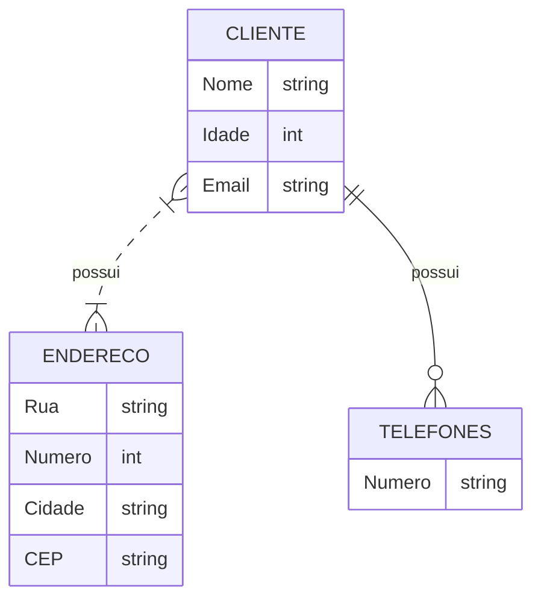
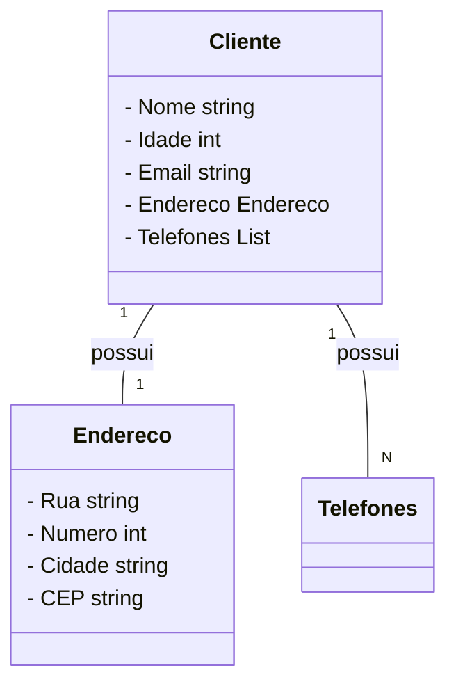

## Instruções do projeto

O desenvolvimento de um projeto de banco de dados passa por fases importantes para a sua implementação, como a de **projeto conceitual**. Diante disso, crie uma entidade que tenha atributos simples, composto e multivalorado.

**Realize essa atividade no WORD ou no Bloco de Notas, suba esse arquivo para algum repositório e compartilhe o link no campo ao lado para que outros desenvolvedores possam analisá-lo.**

### Resposta:

**Entidade:** Cliente

**Atributos:**

    Simples:
        Nome (texto)
        Idade (inteiro)
        Email (texto)
    Composto:
        Endereço:
            Rua (texto)
            Número (inteiro)
            Cidade (texto)
            CEP (texto)
    Multivalorado:
        Telefones (lista de textos)

#### Observações:

Atributos simples são aqueles que possuem apenas um valor para cada instância da entidade.
No exemplo acima, "Nome", "Idade" e "Email" são atributos simples.
Atributos compostos são aqueles que são compostos por outros atributos. No exemplo acima, "Endereço" é um atributo composto, composto pelos atributos "Rua", "Número", "Cidade" e "CEP".
Atributos multivalorados são aqueles que podem ter vários valores para cada instância da entidade. No exemplo acima, "Telefones" é um atributo multivalorado, pois um cliente pode ter vários números de telefone.

#### Mostrando graficamente:

