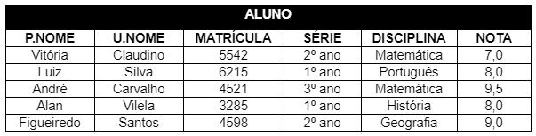

## Instruções do projeto

De acordo com os conceitos estudados, exiba os resultados das consultas das operações select, project, união, intersecção e diferença. Siga as instruções com base na tabela apresentada em anexo.

- Mostre as informações apenas dos alunos aprovados. A aprovação é acima de 7,0;
- Exiba as informações dos alunos do primeiro ano com nota maior ou igual a 8,0;
- Exiba apenas os nomes e as notas dos alunos;
- Crie uma tabela PROFESSOR que apresente apenas o primeiro e o último nome do professor;
- Crie uma tabela ALUNO com o primeiro e o último nome de cada;
- Mostre o resultado da união entre a tabela ALUNO(PNome, UNome) e a tabela PROFESSOR;
- Exiba o resultado da intersecção entre a tabela ALUNO(PNome, UNome) e a tabela PROFESSOR;
- Exiba o resultado da diferença entre a tabela ALUNO(PNome, UNome) e a tabela PROFESSOR.

**Realize essa atividade no WORD ou no Bloco de Notas, suba esse arquivo para algum repositório e compartilhe o link no campo ao lado para que outros desenvolvedores possam analisá-lo.**

### Resposta:

Utilizando a álgebra relacional segue a resolução para cada uma das operações solicitadas:

**Operação SELECT (Restrição) - Mostrar informações apenas dos alunos aprovados (nota acima de 7,0):**

$\sigma_{\text{NOTA} > 7.0}(\text{ALUNO})$

**Operação SELECT (Restrição) - Exibir informações dos alunos do primeiro ano com nota maior ou igual a 8,0:**

$\sigma_{\text{SERIE} = '1° ano' \, \text{AND} \, \text{NOTA} \geq 8.0}(\text{ALUNO})$

**Operação PROJECT (Projeção) - Exibir apenas os nomes e as notas dos alunos:**

$\pi_{\text{P.NOME, U.NOME, NOTA}}(\text{ALUNO})$

**Operação PROJECT (Projeção) - Criar tabela PROFESSOR com primeiro e último nome do professor:**

$\pi_{\text{P.NOME, U.NOME}}(\text{PROFESSOR})$

**Operação PROJECT (Projeção) - Criar tabela ALUNO com o primeiro e o último nome de cada aluno:**

$\pi_{\text{P.NOME, U.NOME}}(\text{ALUNO})$

**União entre a tabela ALUNO(PNome, UNome) e a tabela PROFESSOR:**

$\pi_{\text{P.NOME, U.NOME}}(\text{ALUNO}) \cup \pi_{\text{P.NOME, U.NOME}}(\text{PROFESSOR})$

**Intersecção entre a tabela ALUNO(PNome, UNome) e a tabela PROFESSOR:**

$\pi_{\text{P.NOME, U.NOME}}(\text{ALUNO}) \cap \pi_{\text{P.NOME, U.NOME}}(\text{PROFESSOR})$

**Diferença entre a tabela ALUNO(PNome, UNome) e a tabela PROFESSOR:**

$\pi_{\text{P.NOME, U.NOME}}(\text{ALUNO}) - \pi_{\text{P.NOME, U.NOME}}(\text{PROFESSOR})$
